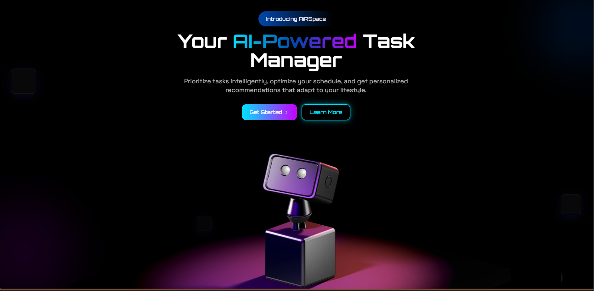
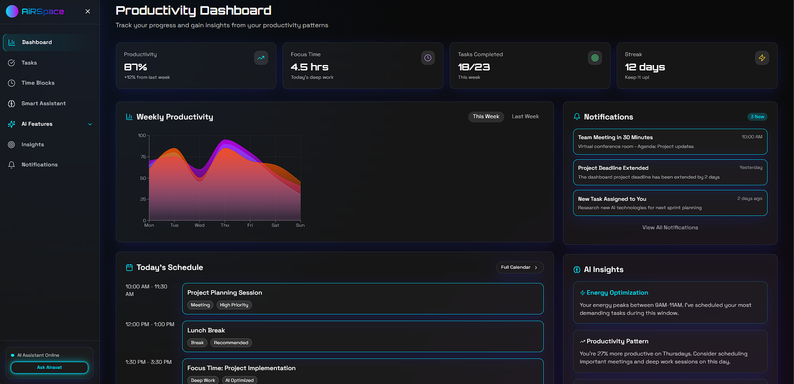
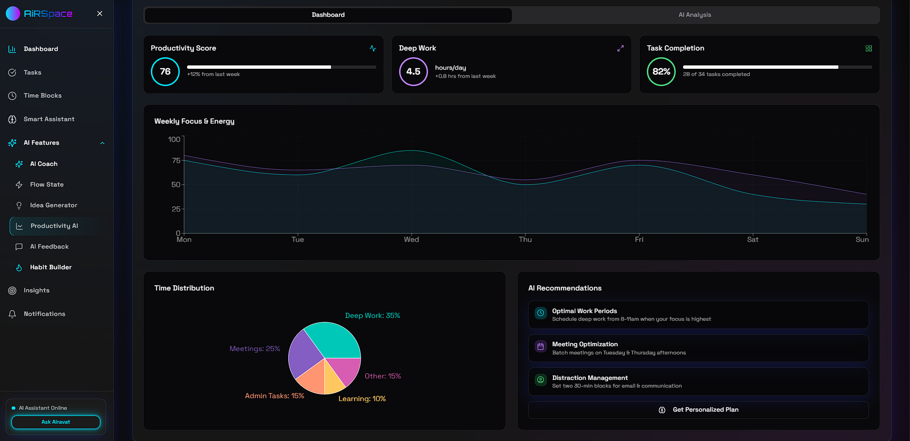
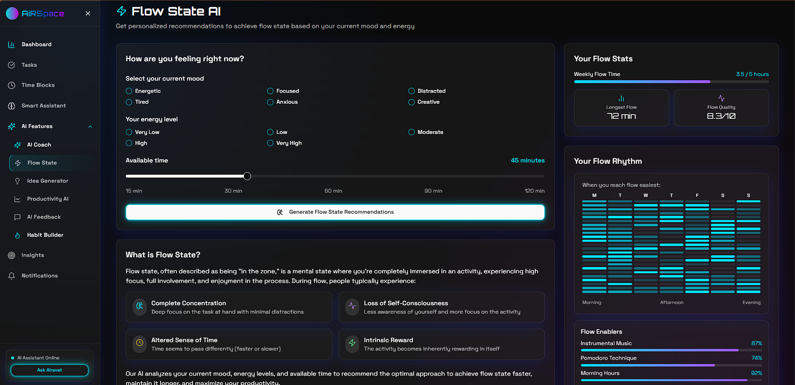
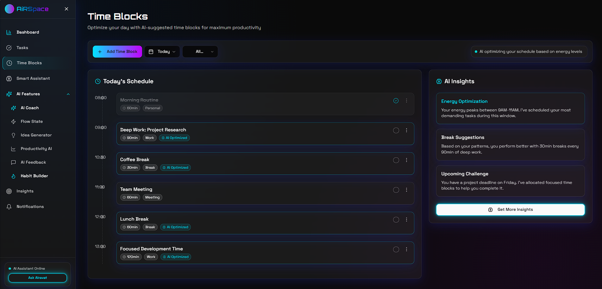

# ⚡ AiRSpace: Smart Productivity AI Assistant

  <b>🧠 Your AI-powered productivity companion, transforming how you work, focus, and achieve goals. 🚀</b>

## 🌟 Key Features

🗓️ **Smart Task Management**
- AI-recommended task prioritization based on your work patterns
- Intelligent categorization and filtering
- One-click task generation powered by AI

⏰ **Time Block Optimization**
- AI-optimized time blocking for maximum focus
- Category-based scheduling with visual indicators
- Completion tracking with performance insights

🤖 **AI Productivity Suite**
- **AI Coach**: Personalized productivity coaching with actionable advice
- **Flow State**: Get recommendations to achieve deep focus based on your mood and energy
- **Idea Generator**: AI-powered brainstorming partner for creative solutions
- **AI Feedback**: Get constructive feedback on your work, projects, and content
- **Habit Builder**: Create sustainable productivity habits with personalized plans
- **Productivity AI**: Analyze your work patterns and get personalized insights

🔔 **Smart Notifications**
- Priority-based notification system
- Contextual reminders and suggestions
- Focus mode that eliminates distractions

📊 **Productivity Analytics**
- Visual performance tracking
- Identify peak productivity hours
- Distraction pattern recognition

## 🛠️ Tech Stack

  
  
  
  
  
  

- **Frontend**: React 18 with TypeScript and Vite for lightning-fast builds
- **UI Framework**: Tailwind CSS with shadcn/ui for elegant, responsive components
- **State Management**: Zustand for simple, efficient state management
- **Routing**: React Router v6 for seamless navigation
- **AI Integration**: Google's Gemini AI for intelligent productivity features
- **Data Visualization**: Recharts for beautiful productivity analytics
- **Form Handling**: React Hook Form with Zod validation
- **Local Storage**: Persistent data with browser storage API
- **Icons**: Lucide React for beautiful, minimal icons

## 📸 Screenshots

  
  

  
  

  

  Made with ❤️ by Team HackStreet

